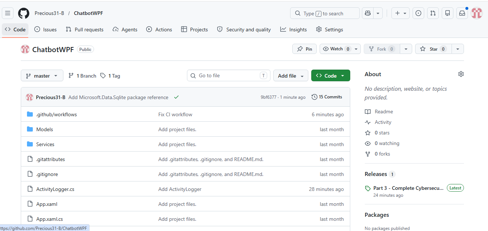

# Cybersecurity Awareness Chatbot

## Module Information
- **Module:** PROG6221 - Programming 2A
- **Assessment:** Portfolio of Evidence (POE)
- **Year:** 2026

## Project Overview
This is a cybersecurity awareness chatbot that educates South African citizens about online safety. The project was developed in three parts, starting from a console application and evolving into a full WPF GUI application with database integration.

---

## Version History

| Version | Part | Description |
|---------|------|-------------|
| v1.0 | Part 1 | Console-based chatbot with voice greeting, ASCII art, keyword responses, and input validation |
| v2.0 | Part 2 | WPF GUI version with keyword recognition, random responses, memory recall, sentiment detection, and conversation flow |
| v3.0 | Part 3 | Complete WPF application with quiz, SQLite task database, activity log, and NLP simulation |

---

## Features by Version

### Part 1 (v1.0) - Console Application
- Voice greeting on startup using WAV file
- ASCII art logo display
- Personalized user interaction (asks for name)
- Basic keyword responses for passwords, phishing, and browsing
- Input validation for empty or unrecognized inputs
- Colored console UI for better readability
- Exit command ("exit" or "bye")

### Part 2 (v1.0) - WPF GUI Application
- Professional GUI with dark theme
- Keyword recognition for: password, phishing, scam, privacy, browsing
- Random responses for each topic (different answer each time)
- Conversation flow with "tell me more" follow-ups
- Memory store to remember user name and interests
- Sentiment detection for worried, frustrated, and curious users
- Empathetic responses based on detected sentiment
- Error handling for unrecognized inputs

### Part 3 (v3.0) - Complete Application

#### Task Assistant with SQLite Database
- Add tasks using "Add task: [title]"
- View all tasks with status (Pending/Completed)
- Mark tasks as complete
- Delete tasks
- Data persists after closing the application

#### Cybersecurity Quiz
- 11 multiple choice questions
- Topics include: passwords, phishing, 2FA, ransomware, VPN, social engineering
- Score tracking throughout quiz
- Immediate feedback with explanations for each answer
- Final score with personalized feedback message

#### Activity Log
- Tracks last 10 user actions
- Timestamps for each action
- View log via button or NLP commands
- Logs include: user messages, quiz attempts, task actions, chat clearing

#### NLP Simulation
- Recognizes different phrasings for the same intent
- Task addition: "add task", "remind me to", "i need to", "remember to"
- View tasks: "show tasks", "view my tasks", "list tasks"
- Start quiz: "take quiz", "play quiz", "do the quiz"
- Activity log: "show log", "what have you done"
- Clear chat: "clear screen", "reset chat"

---

## How to Run the Application

### Requirements
- Visual Studio 2022 or later
- .NET 8.0 SDK
- NuGet package: Microsoft.Data.Sqlite

### Steps
1. Clone this repository
2. Open `CyberSecurityChatbotWPF.sln` in Visual Studio
3. Ensure `voiceGreeting.wav` is in the project root
4. Press F5 to build and run

### First Time Setup
The SQLite database (`tasks.db`) will be created automatically when you first add a task.

---

## Testing Commands

### Chat Commands
| Command | Expected Response |
|---------|-------------------|
| `Tell me about password` | Random password safety tip |
| `What is phishing` | Phishing explanation |
| `I am worried about scams` | Empathetic response + scam tips |
| `Tell me more` | Follow-up tip on last topic |
| `What do you know about me` | Recalls stored name and interests |
| `exit` | Goodbye message |

### NLP Commands
| Command | Action |
|---------|--------|
| `remind me to update my password` | Adds a task |
| `show my tasks` | Displays all tasks |
| `take quiz` | Starts the cybersecurity quiz |
| `what have you done` | Shows activity log |
| `clear screen` | Clears chat history |

### Task Management Commands
| Command | Action |
|---------|--------|
| `Add task: Enable 2FA` | Adds a new task |
| `Complete task 1` | Marks task 1 as completed |
| `Delete task 1` | Deletes task 1 |

---

## GitHub Actions CI

This repository uses GitHub Actions for continuous integration. The workflow builds the .NET project on every push to ensure no compilation errors.

---

## Project Structure

---

## Author

| Field | Information |
|-------|-------------|
| Name | Boitumelo Motaung |
| Student Number | ST10465326 |
| Module | PROG6221 - Programming 2A |
| Year | 2026 |

---

## References

- Pieterse, H. 2021. The Cyber Threat Landscape in South Africa: A 10-Year Review. *The African Journal of Information and Communication*, 28(28). doi: https://doi.org/10.23962/10539/32213